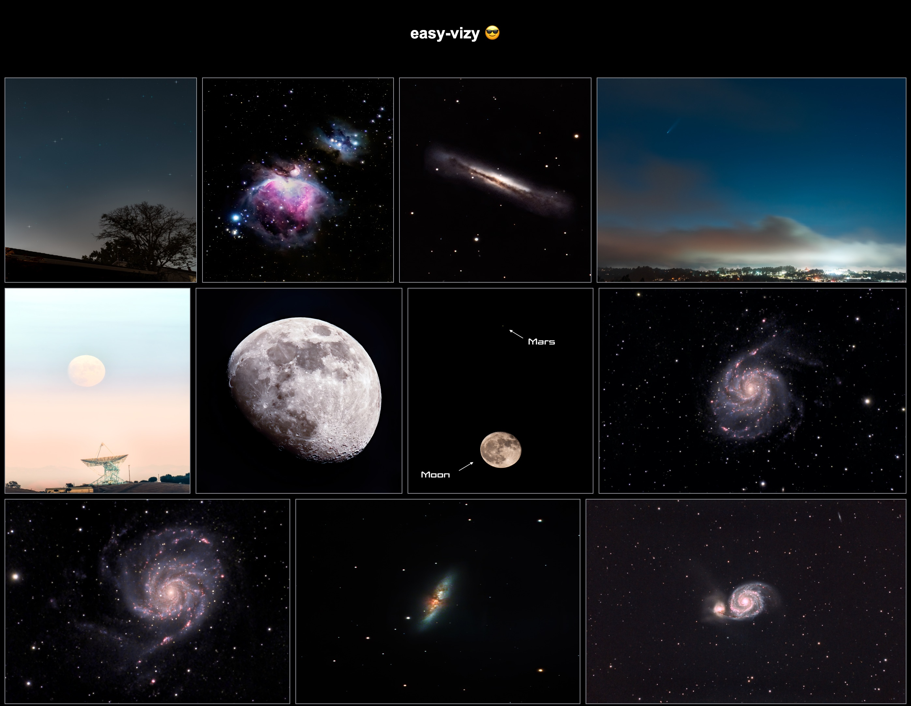

# easy-vizy 😎
Minimal visualization tool to show images on a grid.


Useful for machine learning analysis as you can easily create interactive visualizations through URL linking.





## Getting Started
Install `flask` 
```bash
pip install flask
```

then, run the images server:

```bash
env FLASK_APP=main.py flask run -p 3000
```

If your images are not hosted, you can serve them locally using a simple python http server

```bash
cd images_dir #replace
python -m http.server
```

Take a look at `main.py` and update the image_id to URL mapping function if needed.

```python
def get_image_urls(ids):
    """function to map ids to image URLS"""
    return [f"http://127.0.0.1:8000/{id}" for id in ids]
```

That's all!

Open [http://localhost:3000/?asset_ids=image_id1,imageid2 ...](http://localhost:3000/?asset_ids=image_id1,imageid2) with your browser to see the result.

Make sure to pass valid image ids from your dataset.

## Customization
If you want to customize the visualization, you can edit the page by modifying `templates/index.html`. 


## License

easy-vizy is MIT licensed, as found in the [LICENSE](LICENSE) file. Please note that some of the dependencies AugLy uses may be licensed under different terms.